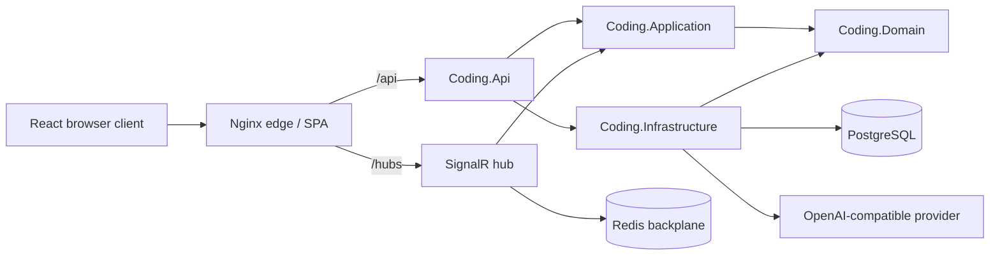
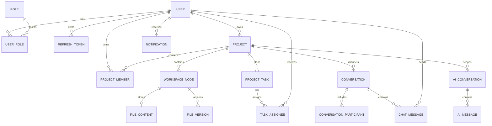
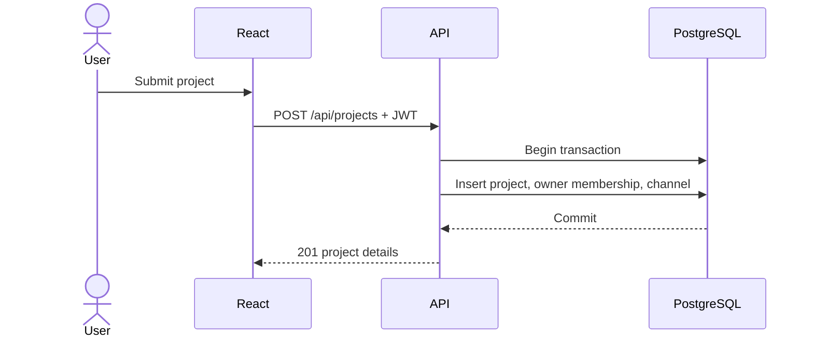
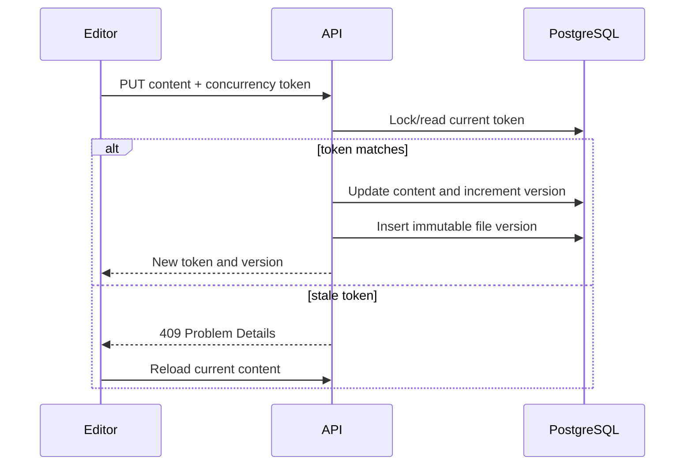
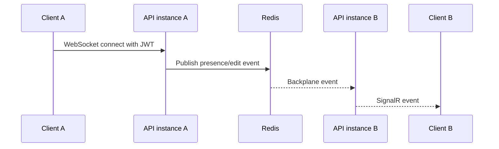
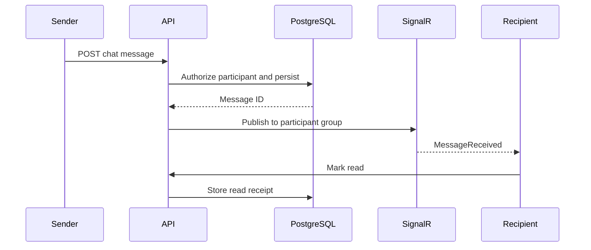
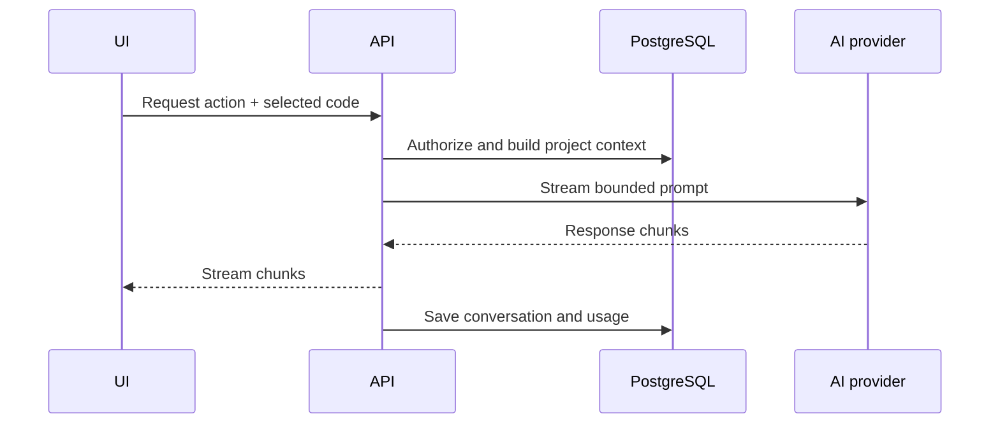

# Coding Platform

Coding Platform is a collaborative software-development workspace with project management, a browser code editor, file versioning, chat, notifications, analytics, administration, and an optional AI assistant. Version 1.0 uses an ASP.NET Core API, React client, PostgreSQL, Redis-backed SignalR, and an Nginx edge container.

## Main features

- JWT authentication, rotating hashed refresh tokens, roles, invitations, and session revocation
- Projects, members, file trees, autosave with optimistic concurrency, and file history
- Kanban tasks, activity history, dashboard analytics, search, notifications, and chat
- SignalR presence and realtime project/chat events, scaled through Redis
- Optional OpenAI-compatible assistant with repository context and usage tracking
- Health checks, structured logs, rate limits, Problem Details errors, and Swagger
- Multi-stage, non-root containers and CI for backend, frontend, tests, and images

## Technology stack

| Area | Technology |
|---|---|
| API | .NET 8, ASP.NET Core, MediatR, FluentValidation |
| Data | EF Core 8, PostgreSQL 16 |
| Realtime/cache | SignalR, Redis 7 |
| Web | React 19, TypeScript, Vite, Monaco Editor, TanStack Query |
| Edge | Nginx unprivileged |
| Tests | xUnit, Testcontainers, Vitest, Playwright |
| Delivery | Docker Compose, GitHub Actions, GHCR |

## Architecture



Dependencies point inward: Domain has no infrastructure dependency; Application defines use cases and contracts; Infrastructure implements persistence and providers; API owns transport and composition.

## Data model



## Prerequisites

- Docker Engine with Compose v2 for the recommended path
- Or .NET SDK 8, Node.js 22, PostgreSQL 16, and optionally Redis 7

## Quick start with Docker

```bash
git clone <repository-url>
cd Coding
cp .env.example .env
openssl rand -base64 48
```

Put strong, unique values into `.env`, then run the controlled migration and start the platform:

```bash
docker compose --profile operations run --rm migrate
docker compose up -d --build
docker compose ps
```

Open `http://localhost:8080`. Only the frontend/reverse-proxy port is published; PostgreSQL, Redis, and the API remain on the internal network. Data is stored in `postgres-data`, `redis-data`, and `avatar-data` named volumes.

```bash
curl --fail http://localhost:8080/health
docker compose logs -f api
docker compose down
```

`docker compose down -v` permanently deletes local database, Redis, and avatar data and should only be used intentionally.

## Local installation without Docker

Create `.env` with a local PostgreSQL connection and JWT secret using the ASP.NET double-underscore names:

```dotenv
ConnectionStrings__Default=Host=localhost;Port=5432;Database=coding;Username=coding;Password=local-password
ConnectionStrings__Redis=
Jwt__Issuer=Coding.Api
Jwt__Audience=Coding.Frontend
Jwt__Key=a-random-development-secret-at-least-32-bytes
Database__ApplyMigrations=false
```

Apply migrations, then start the API and client together:

```bash
dotnet tool restore  # if a tool manifest is added; otherwise use a global dotnet-ef 8 tool
dotnet ef database update --project src/Coding.Infrastructure --startup-project src/Coding.Api
```

```bash
npm --prefix frontend ci
./scripts/dev-local.sh
```

The combined development command stops both processes when you press Ctrl+C,
waits for a healthy API before opening the client, and stops both processes
when you press Ctrl+C. The Visual Studio HTTPS profile also listens on the
HTTP development endpoint used by Vite, so either API launch profile works.

The client is at `http://localhost:5173`, the API at `http://localhost:5192`, and development Swagger at `http://localhost:5192/swagger`.

## Environment variables

Configuration uses normal ASP.NET Core precedence; environment variables override JSON. Never put secrets in `appsettings*.json`, `VITE_*` variables, images, or source control.

| Variable | Required | Purpose |
|---|---:|---|
| `POSTGRES_DB`, `POSTGRES_USER`, `POSTGRES_PASSWORD` | Docker | PostgreSQL bootstrap |
| `REDIS_PASSWORD` | Docker | Redis authentication |
| `JWT_ISSUER`, `JWT_AUDIENCE`, `JWT_KEY` | Yes | JWT validation/signing; key must be at least 32 bytes |
| `FRONTEND_ORIGIN` | Yes | Exact allowed browser origin |
| `ALLOWED_HOSTS` | Yes | Semicolon-separated public host names accepted by ASP.NET Core |
| `SMTP_ENABLED` | No | Enables real email delivery |
| `SMTP_HOST`, `SMTP_PORT`, `SMTP_USERNAME`, `SMTP_PASSWORD` | When SMTP enabled | SMTP transport |
| `SMTP_FROM_EMAIL`, `SMTP_FROM_NAME` | When SMTP enabled | Sender identity |
| `AI_PROVIDER` | No | Selects `OpenAI` in production; local development uses Ollama |
| `OPENAI_COMPATIBLE_BASE_URL`, `OPENAI_COMPATIBLE_MODEL` | No | Ollama/vLLM endpoint and model |
| `OPENAI_API_KEY` | No | Enables the external AI provider |
| `OPENAI_MODEL`, `OPENAI_BASE_URL`, `OPENAI_MAX_OUTPUT_TOKENS` | No | AI provider settings |
| `API_IMAGE`, `FRONTEND_IMAGE` | No | Prebuilt image names |

For direct API execution, replace `_` names with ASP.NET paths where shown in JSON, for example `OpenAI__ApiKey`, `Cors__AllowedOrigins__0`, and `ConnectionStrings__Default`. See [docs/ENVIRONMENT.md](docs/ENVIRONMENT.md).

## Database migrations

Production startup does **not** apply migrations. `Database__ApplyMigrations` remains false in Compose. Back up the database and execute the one-shot migrator before rolling out API instances:

```bash
docker compose pull
docker compose --profile operations run --rm migrate
docker compose up -d --no-deps api frontend
```

If migration fails, do not start the new API version. Restore/roll back according to the reviewed migration plan; EF migrations are not assumed to be automatically reversible. Full guidance is in [docs/DATABASE.md](docs/DATABASE.md).

Create and inspect migrations locally:

```bash
dotnet ef migrations add MeaningfulName \
  --project src/Coding.Infrastructure \
  --startup-project src/Coding.Api

dotnet ef migrations script --idempotent \
  --project src/Coding.Infrastructure \
  --startup-project src/Coding.Api \
  --output migration.sql
```

## Development seed data

Seeding is disabled by default and hard-blocked outside Development. Set:

```dotenv
Database__ApplyMigrations=true
Database__SeedDevelopmentData=true
DevelopmentSeed__AdminPassword=<local strong password>
DevelopmentSeed__DemoPassword=<local strong password>
```

The idempotent seeder creates `admin@coding.local`, `demo@coding.local`, a demo project, memberships, project chat, folders, versioned sample files, and tasks. No default production password exists.

## Request sequences

### Project creation



### File autosave and versioning



### SignalR collaboration



### Chat delivery



### AI request



## Testing and quality gates

```bash
dotnet restore Coding.sln
dotnet build Coding.sln -c Release --no-restore
dotnet test Coding.sln -c Release --no-build

cd frontend
npm ci
npm run lint
npm test
npm run build
npm run test:e2e
```

Integration tests use Testcontainers and require Docker. `npm run lint` is currently a strict TypeScript project check because the repository’s TypeScript 7 compiler is newer than the supported range of the TypeScript ESLint parser.

## API documentation

Swagger/OpenAPI is enabled only in Development at `/swagger`. Authenticate with a bearer access token using the **Authorize** button. Production consumers should generate and publish a reviewed OpenAPI artifact during release if public API documentation is required; the interactive production UI stays disabled.

Errors use RFC 7807 Problem Details. Authentication, AI, and realtime endpoints have separate rate-limit policies.

## Realtime architecture

Clients connect to `/hubs/collaboration` using JWT authentication. Presence is maintained in the API process and SignalR messages are distributed across instances with the Redis backplane. Nginx forwards WebSocket upgrade headers and uses a long read timeout. Redis loss makes realtime unhealthy and should remove an instance from service through `/health`.

## AI provider configuration

The external provider is optional. Configure only the API process:

```dotenv
OPENAI_API_KEY=<secret-manager-reference>
OPENAI_MODEL=gpt-5.1
OPENAI_BASE_URL=https://api.openai.com/v1/
OPENAI_MAX_OUTPUT_TOKENS=4096
```

Never expose an API key through `VITE_*`. Rotate a key immediately if it appears in chat, logs, Git, or a browser bundle. With no key, the deterministic development provider is available; production operators should decide whether that fallback is acceptable.

## Deployment

The production runbook is [docs/DEPLOYMENT.md](docs/DEPLOYMENT.md). See the
[deployment audit](docs/DEPLOYMENT_AUDIT.md), [domain/TLS guide](docs/DOMAIN_AND_SSL.md),
[frontend](docs/FRONTEND_DEPLOYMENT.md), [showcase](docs/SHOWCASE_DEPLOYMENT.md),
[AI](docs/AI_DEPLOYMENT.md), [execution security](docs/EXECUTION_DEPLOYMENT.md), and
[backup/restore](docs/BACKUP_AND_RESTORE.md) guides before operating a release.

The production API edge uses `docker-compose.prod.yml`; the React app and showcase
are deployed independently. The repository does not yet contain a secure execution
worker, so untrusted code execution must remain unavailable.

1. Require green CI on `main`.
2. Review schema changes and an idempotent migration script.
3. Build immutable `v1.0.0` images; publishing is enabled by repository variable `PUBLISH_IMAGES=true`.
4. Inject secrets from the deployment platform, not `.env` in an image.
5. Back up PostgreSQL and run the one-shot migration job.
6. Roll out API instances, then the frontend; wait for health checks.
7. Verify login, project load, autosave, chat, SignalR, and AI configuration.
8. Monitor structured logs, latency, 5xx/429 rates, database connections, and Redis.

TLS terminates at the deployment load balancer or ingress. It must set `X-Forwarded-Proto=https`; the API enables HSTS and HTTPS redirection outside Development.

## Security considerations

- CORS is allow-list-only and fails closed when no origins are configured.
- JWT issuer/audience/signature/lifetime are validated; signing keys shorter than 32 bytes fail startup.
- Refresh tokens are random, stored as SHA-256 hashes, rotated on use, and revocable by session.
- Auth, AI, and realtime traffic is rate limited.
- API and edge responses include anti-sniffing, frame, referrer, permissions, and CSP headers.
- Avatar upload is limited to 5 MB and allow-listed extensions/MIME types; object storage and content-signature inspection are recommended for larger deployments.
- Logs record request type and timing rather than serialized request bodies or tokens.
- Production SQL logging is warning-level and sensitive-data logging is not enabled.
- PostgreSQL and Redis are internal-only in Compose; Redis requires a password.
- Containers run without root privileges and the edge filesystem is read-only.
- Keep dependencies and base images patched and scan images in the registry.

## CI/CD

`.github/workflows/ci.yml` runs for pull requests and `main`: NuGet restore/cache, backend build/tests, npm cache/install, frontend lint/tests/build, and cached Docker builds. `.github/workflows/publish-images.yml` publishes versioned GHCR images only for tags/manual runs when `PUBLISH_IMAGES=true`.

## Contributing

1. Branch from `main`.
2. Keep changes scoped and add tests for behavior.
3. Never commit secrets, generated build output, local databases, or IDE state.
4. Run the full quality commands above.
5. Document migrations, configuration changes, security impact, and known limitations.
6. Open a pull request and obtain review before merge.

## Release information and known limitations

See [CHANGELOG.md](CHANGELOG.md) and [docs/releases/v1.0.0.md](docs/releases/v1.0.0.md). Known limitations are intentionally listed in the release notes.
