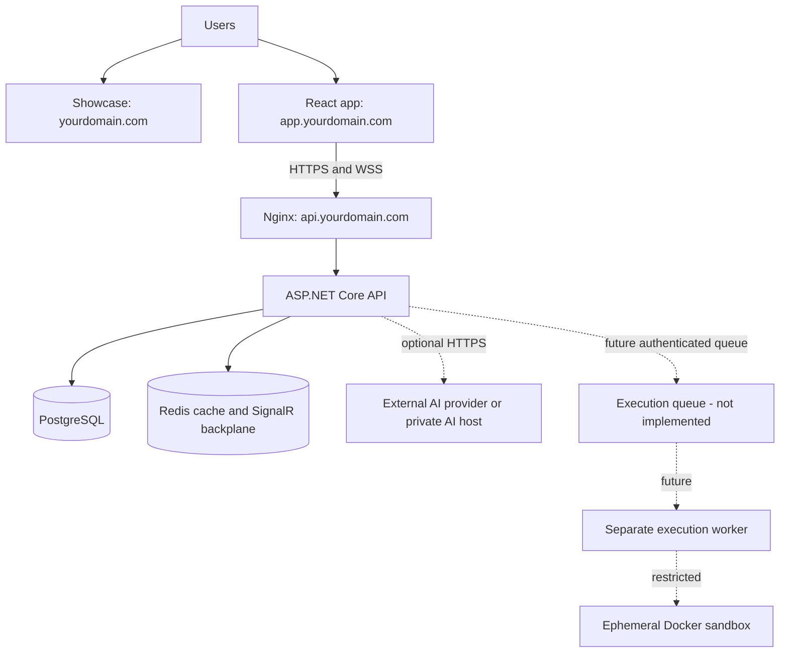

# Production deployment

## Architecture



The main VPS runs Nginx, API, PostgreSQL and Redis. The React app and showcase are independent. The execution path is deliberately marked future because the repository has no worker or queue.

## VPS prerequisites

- Ubuntu LTS, Docker Engine and Compose v2.
- Firewall permitting SSH, HTTP 80 and HTTPS 443 only.
- Repository checkout at `/opt/coding` (or set the Actions `DEPLOY_PATH` variable).
- A root-owned `/opt/coding/.env` created from `.env.example`, mode `600`.
- DNS and TLS configured as described in `DOMAIN_AND_SSL.md`.

## First deployment

```bash
cp .env.example .env
# Replace placeholders; never commit this file.
docker compose --env-file .env -f docker-compose.prod.yml config
docker compose --env-file .env -f docker-compose.prod.yml build api
docker compose --env-file .env -f docker-compose.prod.yml up -d postgres redis
./scripts/backup-postgres.sh
docker compose --env-file .env -f docker-compose.prod.yml --profile operations run --rm migrator
docker compose --env-file .env -f docker-compose.prod.yml up -d
curl --fail http://127.0.0.1/health/ready
```

Migrations never run automatically on ordinary API startup. Review migration SQL and take a backup before `migrator`. Subsequent releases use `scripts/deploy-production.sh`.

## Health and realtime verification

- `/health/live`: process liveness only.
- `/health/ready`: PostgreSQL and configured Redis.
- `/health`: aggregate compatibility endpoint.

After TLS is active, verify `https://api.yourdomain.com/health/ready`, login/refresh, project authorization, browser SignalR transport `WebSockets`, chat/notification delivery, collaboration reconnect, and direct-route refreshes in the React app. AI availability is tested separately and cannot make core readiness fail.

## CI/CD

`ci.yml` runs .NET and both web application checks. On successful main CI, `docker-publish.yml` publishes the API to GHCR. A successful image workflow can trigger `deploy.yml`, which uses `VPS_HOST`, `VPS_USER`, `VPS_SSH_KEY`, and optional `DEPLOY_PATH`. Store the production `.env` only on the VPS.

## Logs and rollback

The API writes structured JSON to stdout. Use `docker compose ... logs --since 30m api nginx`; configure VPS log rotation or a container log collector. Logs must not contain tokens, passwords, connection strings, request bodies or AI keys. For rollback, select the previous immutable `sha-*` image, assess database compatibility, update `API_IMAGE`, and redeploy. Database rollback is a reviewed restore/migration operation, not an automatic EF down migration.
